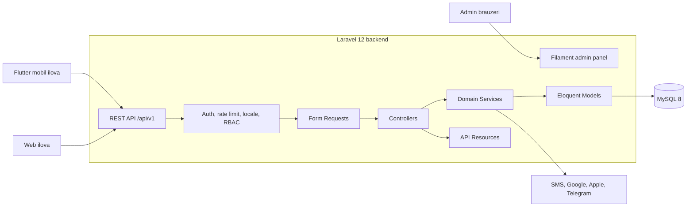

<p align="center">
  
</p>

<h1 align="center">TAQSEEM Backend</h1>

<p align="center">
  Kichik ishlab chiqarish bizneslari uchun tannarx, foyda, xarajat va buyurtmalarni boshqarish platformasi.
</p>

<p align="center">
  
  
  
  
</p>

## Loyiha haqida

**TAQSEEM** — nonvoyxona, qandolatchilik, somsaxona, shirinlik sexi va boshqa kichik ishlab chiqaruvchilarga kundalik hisob-kitoblarini aniq yuritishda yordam beradigan raqamli boshqaruv tizimi. Platforma xom ashyo va retseptlardan mahsulot tannarxini hisoblaydi, ishlab chiqarish, sotuv, xarajat, foyda va mijoz buyurtmalarini yagona tizimda kuzatish imkonini beradi.

Backend mobil Flutter ilovasi va web boshqaruv interfeysi uchun xavfsiz, versiyalangan REST API taqdim etadi. Tizim real foydalanuvchilar va real biznes ma'lumotlari bilan production muhitida ishlaydi.

## President Tech Award uchun qisqa mazmun

- **Maqsad:** kichik ishlab chiqaruvchilarda moliyaviy hisob va operatsion boshqaruvni raqamlashtirish.
- **Kimlar uchun:** nonvoyxona, qandolatchilik, somsaxona, oziq-ovqat sexlari va xom ashyodan mahsulot ishlab chiqaradigan boshqa kichik bizneslar.
- **Muammo:** tannarx ko'pincha taxminan hisoblanadi; xom ashyo, xarajat, buyurtma va foyda ma'lumotlari daftar yoki tarqoq jadvallarda yuritiladi.
- **Yechim:** retseptga asoslangan tannarx hisoblash, ishlab chiqarish va buyurtmalarni kuzatish, avtomatik moliyaviy hisobotlar hamda ko'p biznesli yagona hisob.
- **Innovatsion jihat:** murakkab ishlab chiqarish hisobini kichik biznes egasi telefon orqali ishlata oladigan sodda va mahalliy jarayonlarga mos tizimga aylantiradi.
- **Texnologiyalar:** Laravel 12, PHP 8.3+, MySQL 8, Laravel Sanctum, Filament, Docker va Flutter mobil mijoz.

## Muammo

Kichik ishlab chiqaruvchilar quyidagi muammolarga tez-tez duch keladi:

- xom ashyo narxi o'zgarganda mahsulot tannarxini qayta hisoblash qiyin;
- haqiqiy foyda bilan savdo tushumi aralashtirib yuboriladi;
- ijara, transport, ish haqi va boshqa xarajatlar to'liq hisobga olinmaydi;
- buyurtma, to'lov, ishlab chiqarish va yetkazib berish holatlari tarqoq yuritiladi;
- bir egaga tegishli bir nechta biznes bo'yicha alohida hisob yuritish murakkab;
- xodimlarga kerakli darajada ruxsat berish va faoliyatni nazorat qilish qiyin.

Natijada tadbirkor biznesining aniq moliyaviy holatini ko'rmaydi va muhim qarorlarni taxminiy ma'lumotlar asosida qabul qiladi.

## Bizning yechim

TAQSEEM retsept, xom ashyo va ishlab chiqarish ma'lumotlarini birlashtirib, tannarx hamda moliyaviy natijalarni tizimli hisoblaydi. Har bir biznesning ma'lumotlari ajratilgan, foydalanuvchilar rollar va ruxsatlar orqali boshqariladi, API javoblari esa mobil va web mijozlar uchun yagona formatda taqdim etiladi.

## Asosiy imkoniyatlar

### Ishlab chiqarish va moliya

- xom ashyo, o'lchov birligi va valyutalarni boshqarish;
- mahsulot va retseptlar yaratish;
- retsept asosida bir partiya tannarxini hisoblash;
- ishlab chiqarilgan va sotilgan mahsulotlarni kuzatish;
- qaytimlarni hisobga olish;
- xarajatlar va moslashuvchan xarajat kategoriyalari;
- kunlik, davriy va umumiy moliyaviy hisobotlar;
- foyda, tushum, tannarx va sarflangan xom ashyo ko'rsatkichlari.

### Buyurtmalar

- mijozlar bazasi;
- bir nechta mahsulotli buyurtmalar;
- qisman va to'liq to'lovlar;
- buyurtmani tayyorlash, yetkazish va bekor qilish jarayonlari;
- qarzdorlik va qolgan to'lovni hisoblash.

### Biznes va jamoa

- bitta foydalanuvchi uchun bir nechta biznes;
- biznes turi, manzil, koordinata va valyuta sozlamalari;
- egasi va xodim rollari;
- mahsulot, retsept, ishlab chiqarish, sotuv, buyurtma, xarajat va hisobotlar uchun alohida ruxsatlar;
- OTP orqali xodim qo'shish.

### Xavfsizlik va platforma

- telefon raqami va SMS OTP orqali ro'yxatdan o'tish;
- Google, Apple va Telegram orqali autentifikatsiya;
- Laravel Sanctum bearer tokenlari va ko'p qurilmali sessiyalar;
- rate limiting, input validation va bloklangan account nazorati;
- accountni xavfsiz o'chirish va shaxsiy identifikatorlarni anonimlashtirish;
- Filament asosidagi admin panel;
- database backup boshqaruvi;
- o'zbek (lotin va kirill), rus, qozoq, qirg'iz, tojik va turk tillaridagi API xabarlari.

## Tizim ko'rinishi



Arxitektura mas'uliyatlarni qatlamlarga ajratadi:

1. **Controllers** — HTTP so'rov va javoblarini boshqaradi.
2. **Form Requests** — kiruvchi ma'lumotlarni tekshiradi.
3. **Services** — biznes qoidalari, tranzaksiyalar va hisob-kitoblarni bajaradi.
4. **Eloquent Models** — ma'lumotlar va bog'lanishlarni ifodalaydi.
5. **API Resources** — mobil va web uchun barqaror response formatini yaratadi.

## Texnologiyalar

| Qism | Texnologiya |
|---|---|
| Backend | PHP 8.3+, Laravel 12 (Docker image: PHP 8.4) |
| Ma'lumotlar bazasi | MySQL 8 |
| Autentifikatsiya | Laravel Sanctum, SMS OTP, Google, Apple, Telegram |
| Admin panel | Filament 3 |
| API hujjatlari | OpenAPI 3, L5-Swagger |
| Frontend assetlar | Vite, Tailwind CSS |
| Infratuzilma | Docker, Nginx, PHP-FPM |
| Testlash | PHPUnit 11, Laravel Feature/Unit Tests |
| Mobil mijoz | Flutter, Riverpod |

## Lokal ishga tushirish

### Talablar

- Docker va Docker Compose;
- yoki PHP 8.3+, Composer 2, MySQL 8 va Node.js 20+.

### Docker orqali

1. Repozitoriyni klonlang:

```bash
git clone git@github.com:khurshidmir12345/TAQSIM.git
cd TAQSIM
```

2. Muhit faylini tayyorlang:

```bash
cp .env.example .env
```

3. `.env` ichida lokal muhit uchun kamida quyidagilarni to'ldiring:

```dotenv
DB_ROOT_PASSWORD=your-local-root-password
DB_PASSWORD=your-local-app-password

# Ixtiyoriy: lokal Filament admin hisobini yaratish uchun
FILAMENT_ADMIN_EMAIL=admin@example.test
FILAMENT_ADMIN_PASSWORD=choose-a-strong-local-password
FILAMENT_ADMIN_NAME=Local Administrator
```

`DB_ROOT_PASSWORD` va `DB_PASSWORD` bo'sh qolsa, MySQL containeri ishga tushmaydi. `.env` faylini Git'ga qo'shmang.

4. Dependency va containerlarni tayyorlang:

```bash
docker compose build app
docker compose run --rm app composer install
docker compose up -d
```

5. Laravel'ni sozlang:

```bash
docker compose exec app php artisan key:generate
docker compose exec app php artisan migrate --seed
```

6. Frontend assetlarini yig'ing:

```bash
npm install
npm run build
```

Loyiha: [http://localhost:8086](http://localhost:8086)

### Docker'siz

```bash
composer install
cp .env.example .env
# .env ichida lokal MySQL ulanishini sozlang
php artisan key:generate
php artisan migrate --seed
npm install
npm run build
php artisan serve
```

Queue vazifalari uchun alohida terminalda:

```bash
php artisan queue:work
```

## Foydali manzillar

| Manzil | Vazifasi |
|---|---|
| `/api/ping` | API holatini tekshirish |
| `/api/v1/*` | Versiyalangan REST API |
| `/api/documentation` | Lokal Swagger UI |
| `/admin` | Filament admin panel |
| `/delete-account` | Accountni o'chirish sahifasi |

Swagger hujjatini yangilash:

```bash
php artisan l5-swagger:generate
```

## Testlash va kod sifati

```bash
composer test
./vendor/bin/pint --test
```

Muayyan test guruhini ishga tushirish:

```bash
php artisan test --filter=Auth
php artisan test tests/Feature/CustomerOrderTest.php
```

## Xavfsizlik

- `.env`, `.env.*`, private key, token va database backup fayllari Git'da saqlanmaydi.
- `.env.example` faqat bo'sh yoki xavfsiz lokal placeholderlardan iborat.
- Production secretlar server environment variables orqali beriladi.
- Barcha API inputlari serverda tekshiriladi.
- Muhim yozuvlar database transaction ichida bajariladi.

Xavfsizlik muammosini topsangiz, ommaviy issue ochmasdan [support@taqseem.uz](mailto:support@taqseem.uz) manziliga xabar bering.

## Jonli loyiha va media

- **Landing page:** [https://taqseem.uz](https://taqseem.uz)
- **Web ilova:** [https://web.taqseem.uz](https://web.taqseem.uz)
- **Instagram:** [@taqseem.uz](https://instagram.com/taqseem.uz)
- **YouTube / demo videolar:** [TAQSEEM kanali](https://youtube.com/@taqseem)

> Mobil ilovaning yangi demo videosi va mahsulot ekranlari tanlov taqdimoti bilan birga yangilanadi.

## Rivojlanish rejasi

- soliq hisobotlariga tayyorgarlikni soddalashtiruvchi moliyaviy ma'lumotlar;
- O'zbekiston soliq ekotizimi bilan qonuniy va xavfsiz integratsiya imkoniyatlarini o'rganish;
- tadbirkorlar uchun tushunarli soliq eslatmalari va hisobot eksporti;
- buyurtma, ishlab chiqarish va xarajatlar bo'yicha chuqurroq tahlil;
- internet sifati past hududlar uchun sinxronizatsiya imkoniyatlarini rivojlantirish.

> Soliq tizimi bilan integratsiya hozirgi funksional emas — bu kelajakdagi strategik yo'nalish.

## Repository tarkibi

```text
app/
├── Http/Controllers/   # API va web controllerlar
├── Http/Requests/      # Validatsiya
├── Http/Resources/     # API response formatlari
├── Services/           # Biznes logika va tranzaksiyalar
├── Models/             # Eloquent modellar
└── Filament/           # Admin panel
database/
├── migrations/
├── seeders/
└── factories/
routes/
├── api.php
└── web.php
tests/
├── Feature/
└── Unit/
```
